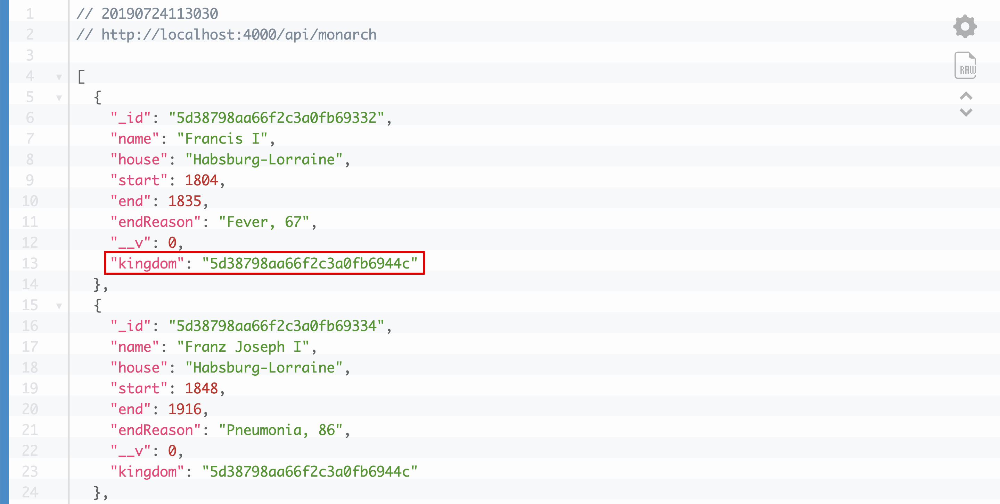

# Monarchs: A Seeding Exercise

So far in this unit, you have spent some time creating models and seeding data
into your database. Seeding data can get a little more complicated when you have
related models, or models that reference another model.

In this exercise, you will need to consider the data types of the provided data
v. the SchemaType your model has declared. For example here, `monarchRaw.json`
provides the kingdom as a string, but the Monarch model requires the kingdom's
SchemaType to be an `ObjectId`.

You have been provided with robust starter code for an Express application that
will display data about monarchs and their kingdoms, including raw JSON data and
models. Your objective is to seed the desired data from the provided models into
a local database using Mongoose, making sure each monarch references the kingdom
over which they reigned.

## Prerequisites

- Node & NPM
- MongoDB
- Mongoose
- Data Modeling
- Express

## Instructions

1. Fork and clone this repository.
1. Change into the new directory.
1. Install dependencies.
1. Fulfill the listed requirements.

Please turn in your submission by the deadline on your cohort calendar.

## Requirements

Before you begin, take some time to familiarize yourself with the starter code.
Look through the routes and controllers to find out what data this application
will display, and at which path. Examine the models carefully, paying close
attention to the properties in each schema. Once you have done this,fulfill the
requirements below.

**Hint:** You will not need to make any adjustments to the `index.js` file,
routes, controllers, models, raw data or `db/connection.js` files. You will only
be working in the files located in the `db/seed` directory.

1. In `00--seed-collections.js`, map throught the monarch raw data (from the
   JSON) to create a new array of objects that only includes the properties
   needed in the Monarch model in the Express application.

   **Hint:** We don't want to change the model itself. The `"kindom"` key is not
   an ObjectId so it is ok to exclude it in this step.

1. In the same file, follow a similar process to map through the kingdom raw
   data to create a new array of objects that only includes the necessary
   properties.

1. Still in `00--seed-collections.js`, use the new array of monarch and kingdom
   data to seed their respective collections in your local database.

1. Use `node db/seed/00--seed-collections.js` and confirm your local database
   has the for both Monarchs and Kingdoms.

At this point, the `"kingdom"` field for each monarch should be blank.

1. In `01--seed-related-models.js` seed your data in a way that updates the
   monarchs collection to include the `ObjectId` of the kingdom over which each
   monarch reigned.

   One way to do this is to get all of the Monarchs from the database (**hint:**
   using mongoose). This is important because we can _save_ each document when
   we update it to add the kingdom as we iterate through the array of documents
   we get from the Mongoose query.

   If we import the original raw JSON for each Monarch, we can use something the
   the `"name` property for each Monarch document (from you database) to _find_
   that monarch's raw JSON data.

   Since the JSON has the String name of the Kingdom, we can use a Mongoose
   query for Kingdoms (from your database) to find that Kingdom AND it's
   ObjectId.

   We can then set that ObjectId for that monarch's `"kindom"` property, and
   presto!

1. Use `node db/seed/01--seed-related-models.js` to seed the related model
   fields in your local database.

1. Run the express application and use the provided endpoints to confirm!

   

## Bonus

Use the `.populate` method to display the `name` and `extract` from each kingdom
in the monarchs collection.

[Mongoose Documentation on Query Population](https://mongoosejs.com/docs/3.4.x/docs/populate.html)

## Plagiarism

Take a moment to refamiliarize yourself with the
[Plagiarism policy](https://git.generalassemb.ly/DC-WDI/Administrative/blob/master/plagiarism.md).
Plagiarized work will not be accepted.

## [License](LICENSE)

1.  All content is licensed under a CC­BY­NC­SA 4.0 license.
1.  All software code is licensed under GNU GPLv3. For commercial use or
    alternative licensing, please contact legal@ga.co.
